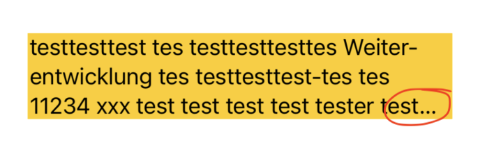

# Hyphenation of German text causes truncated text

See this example project or the following code snippets.

The code needs to run in a project localized in German + device or simulator running in German.

Reproduced on:

- iOS 18.2.1 on device (iPhone 15 Pro and iPad Pro 11“ 2nd gen)
- iOS 18.2 on Simulator (iPad Pro (11-inch) (4th generation), iPhone 13 mini) -  device size seems to matter, f.e. ListExample doesn't reproduce the issue on iPhone 16 Simulator

Example snippets:

```
struct TextOnlyExample: View {
    var body: some View {
        VStack {
            Text("testtesttest tes testtesttesttes Weiterentwicklung tes testtesttest-tes tes 11234 xxx test test test test tester test Hallo:")
                .lineLimit(nil)
                .frame(width: 317)
                .background(Color.yellow)
        }
    }
}
```



```
struct ListExample: View {
    var body: some View {
        List {
            Text("Hello World")
            Section("Foo \(String(describing: Locale.current.language.languageCode?.identifier ?? "-"))") {
                Text("Bulgarien liegt an der Westseite des Schwarzen Meeres. Der südliche Rand der Donauebene neigt nach oben zu den Ausläufern des Balkangebirges, während die Donau die Grenze zu Rumänien definiert.")
            }
        }
        .listStyle(.plain)
        .frame(width: 368)
    }
}
```


